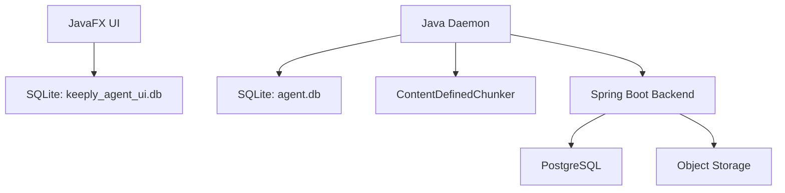

# Architecture Reference: Keeply

Keeply is a distributed backup system designed for efficiency and deduplication.

## High-Level Diagram

## Component Roles

- **Agent Daemon:** The workhorse. Runs in background, executes scheduled backups, communicates with the backend.
- **ContentDefinedChunker:** Implements Rabin Fingerprinting / Rolling Hash to split files. Crucial for deduplication.
- **LocalDatabase (SQLite):**
    - `file_cache`: Stores path, size, mtime, hash to detect changes without re-reading bytes.
    - `known_chunks`: Tracks which hashes are already on the server to skip uploads.
- **Backend:** Manages user accounts, device registration, and snapshot metadata.
- **Object Storage (MinIO):** Stores the actual data chunks, deduplicated by hash across the user's account.

## Critical Flow: Streaming Backup

1. **Scan:** `FileScanner` returns a `Stream<Path>`.
2. **Filter:** Skip directories like `.cache`, `node_modules`.
3. **Compare:** Check local SQLite cache for each file.
4. **Process:** If changed, read file *once* into `ContentDefinedChunker`.
5. **Upload:** Emit `ChunkPayload` objects to a parallel upload pool.
6. **Finalize:** Construct and upload the JSON `SnapshotManifest`.
