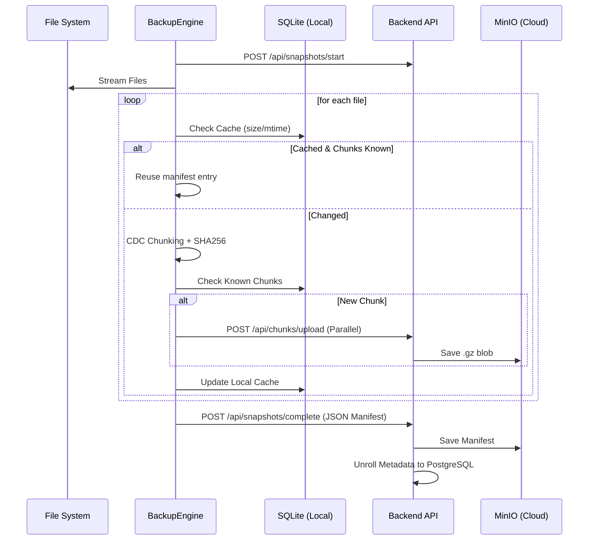
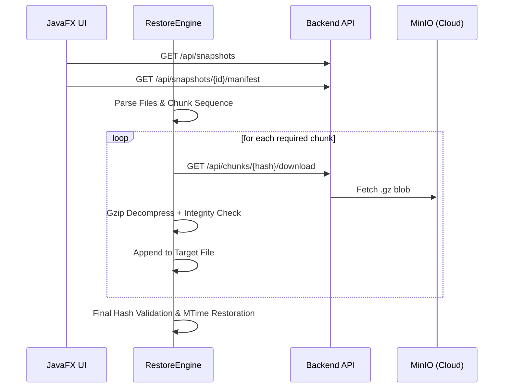

# Keeply Architecture: Comprehensive Vision

Keeply is a high-performance, deduplicated backup system designed for efficiency, security, and scalability. This document provides a complete overview of the current system architecture, data flows, and technical mandates.

## 1. System Overview

Keeply follows a distributed Client-Server model:
- **Agent (Java/JavaFX):** Performs local scanning, Content-Defined Chunking (CDC), compression, and parallel uploading. It maintains a local SQLite cache for ultra-fast incremental backups.
- **Backend (Spring Boot):** Manages user accounts, device registration, and snapshot metadata. It "unrolls" backup manifests into a relational PostgreSQL schema for efficient querying.
- **Storage (MinIO):** A deduplicated object storage where data chunks and manifests are stored with per-user isolation.

---

## 2. Agent Architecture

### 2.1. Streaming Backup Pipeline
The agent uses a "river" approach to data:
1. **Lazy Scanner:** `FileScanner` discovery is streamed, avoiding memory spikes for millions of files.
2. **JIT Processing:** `BackupEngine` processes files one-by-one.
3. **CDC Engine:** `ContentDefinedChunker` uses a shift-add rolling hash to find boundaries. It reads disk in 64KB blocks but evaluates byte-by-byte for precision.
4. **Parallel Upload:** Chunks are emitted into a thread pool (size 4) for concurrent transmission.

### 2.2. Local Caching & Deduplication
- **`agent.db` (SQLite):**
    - `file_cache`: Stores `{path, size, mtime, hash}` to skip processing of unchanged files.
    - `known_chunks`: Tracks hashes already on the server to prevent redundant uploads.
- **Cloud Sync:** `autoSyncCache` can reconstruct the local index by downloading the latest manifest from the backend.

### 2.3. Daemon & Scheduling
- **Lifecycle:** The `KeeplyAgentDaemonApp` runs headlessly, managed via a PID lock (`daemon.pid`).
- **Scheduling:** `CronScheduler` handles periodic execution using recursive Unix-style cron tasks.
- **Logs:** All background activity is streamed to `~/keeply/daemon.log`.

---

## 3. Backend Architecture

### 3.1. Metadata Management
When a snapshot completes, the backend parses the JSON manifest:
- **Relational Unrolling:** Files and Chunks are persisted in PostgreSQL.
- **Schema:** `Snapshot` (1) -> (N) `SnapshotFile` (1) -> (N) `FileChunk` (N) -> (1) `ChunkEntity`.
- **Integrity:** Chunks are immutable and shared across snapshots of the same user.

### 3.2. Deduplicated Storage Strategy
- **Path:** `users/{userId}/chunks/{prefix}/{hash}.gz`.
- **Isolation:** Deduplication is scoped per-user to prevent cross-account information leaks (hash-probing attacks).

---

## 4. Security Framework

### 4.1. Device Identity
Every installation has a unique `deviceInstallationId` stored in `device-auth.json`. This ID is used to link the machine to a user account during the first login.

### 4.2. JWT Rotation Flow
1. **Login:** User provides credentials -> Backend issues Access/Refresh pair.
2. **Rotation:** Every refresh invalidates the old Refresh Token and issues a new pair.
3. **Transparent Retry:** `BackendClient` intercepts 401 errors, performs an automatic refresh, and retries the request seamlessly.
4. **Thread-Safety:** `refreshSession` is synchronized to prevent collisions during parallel chunk uploads.

---

## 5. Critical Data Flows

### 5.1. Backup Flow (Streaming)

### 5.2. Restore Flow

---

## 6. Technical Mandates

1. **O(1) Memory:** Never hold full file lists or full chunk payloads in RAM.
2. **Atomic Completion:** A snapshot is only marked `COMPLETED` after the manifest is unrolled in the DB.
3. **Persistent Connections:** Agent databases and backend clients must use persistent/thread-safe connections.
4. **Immutable Chunks:** Data chunks, once written to MinIO, are never modified.

---
*Generated by Gemini CLI Agent - 2026-05-23*
