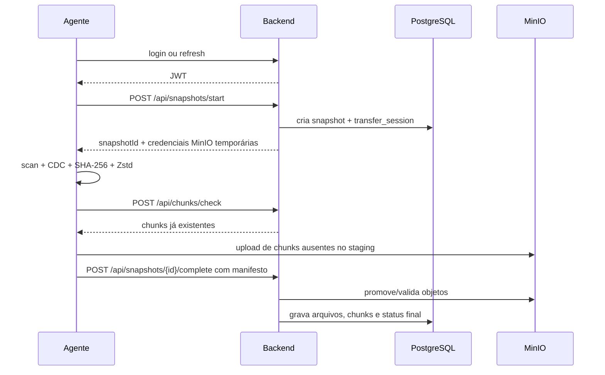

# Agente Keeply

O agente é o componente que roda na máquina protegida. Ele existe em dois modos:

- **UI JavaFX:** interface local para autenticação, status e execução manual.
- **Daemon headless:** processo agendado para executar ciclos de backup sem interação do usuário.

## Responsabilidades

- Ler a configuração local (`agent.yaml`).
- Autenticar usuário/dispositivo no backend.
- Sincronizar plano de proteção do dispositivo.
- Fazer scan dos diretórios configurados.
- Dividir arquivos em chunks por Content-Defined Chunking.
- Calcular SHA-256 de arquivos e chunks.
- Comprimir chunks com Zstandard.
- Deduplicar chunks já conhecidos localmente e no backend.
- Fazer upload direto para MinIO com credenciais temporárias.
- Enviar manifesto ao backend e finalizar snapshot.
- Restaurar arquivos a partir de manifesto + chunks.

## Principais classes

| Classe | Papel |
| --- | --- |
| `KeeplyAgentApp` | Entrada da interface JavaFX. |
| `KeeplyAgentDaemonApp` | Entrada do modo daemon. |
| `BackupCycleRunner` | Coordena execução recorrente do backup. |
| `CronScheduler` | Calcula próximas execuções com cron UNIX. |
| `BackupEngine` | Orquestra scan, chunking, compressão, deduplicação, upload e finalização. |
| `RestoreEngine` | Reconstrói arquivos a partir de chunks e valida hashes. |
| `ContentDefinedChunker` | Realiza chunking baseado no conteúdo. |
| `ZstdChunkCodec` / `ZstdCompressor` | Compressão e descompressão Zstandard. |
| `DirectTransferStorage` | Acesso direto ao MinIO usando credenciais temporárias. |
| `LocalDatabase` e `core/db/*` | Cache local SQLite e estado de snapshots/chunks. |
| `DeviceAuthStore` | Persistência local de autenticação do dispositivo. |
| `ProtectionPlanSyncService` | Sincroniza plano de proteção definido no backend. |

## Fluxo de backup



## Fluxo de restore

1. Usuário seleciona snapshot/arquivo.
2. Agente ou frontend solicita sessão de restore.
3. Backend emite credenciais temporárias read-only.
4. Cliente lê manifesto e chunks necessários.
5. `RestoreEngine` reconstrói o arquivo.
6. Hash final é validado antes de considerar a restauração concluída.

## Configuração

O agente procura `agent.yaml` nos locais padrão:

| Sistema | Caminho |
| --- | --- |
| Linux | `~/.config/keeply/agent.yaml` |
| Windows | `%APPDATA%\keeply\agent.yaml` |
| Override | `--config <caminho>` |

Exemplo:

```yaml
backend:
  url: http://localhost:8080

auth:
  email: keeply@keeply.com
  password: keeply123
  # token: "<jwt-opcional>"

device:
  name: workstation-main

backup:
  sources:
    - /home/user/Documents

schedule:
  cron: "*/30 * * * *"
  runOnStartup: false
```

## Dados locais

| Tipo | Linux | Windows |
| --- | --- | --- |
| Configuração | `~/.config/keeply/` | `%APPDATA%\keeply\` |
| Banco local | `~/.local/share/keeply/` | `%LOCALAPPDATA%\keeply\` |
| Logs | `~/.local/state/keeply/` | `%LOCALAPPDATA%\keeply\` |
| Runtime/PID | `/tmp/keeply/` | `%TEMP%\keeply\` |

## Execução

Interface:

```bash
./gradlew :agent:run
```

Daemon:

```bash
./gradlew :agent:runDaemon -PdaemonArgs="--config /caminho/agent.yaml"
```

Gerar scripts do daemon:

```bash
./gradlew :agent:daemonStartScripts
```

O launcher é gerado em:

```text
agent/build/daemon/bin/keeply-agent-daemon
agent/build/daemon/bin/keeply-agent-daemon.bat
```

## Limitações atuais

- O daemon depende de configuração local válida; não há instalador systemd/Task Scheduler versionado neste pacote.
- A deduplicação depende da consistência entre cache local, backend e MinIO.
- A restauração deve ser feita preferencialmente em diretório temporário antes de sobrescrever dados reais.
- O agente ainda possui pontos de compatibilidade/migração local que podem ser removidos em uma versão futura.

## Melhorias recomendadas

- Serviço de instalação Linux/Windows versionado no repositório.
- Backoff progressivo em polling de status.
- Restore atômico por arquivo usando arquivo temporário + rename.
- Testes de integração cobrindo backup completo, restore e falhas de rede.
- Criptografia client-side antes do upload.
