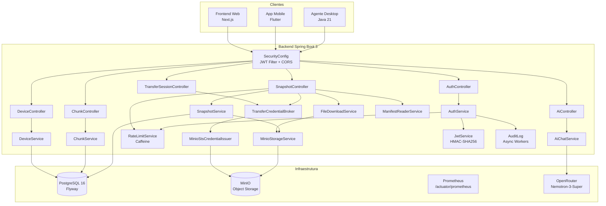
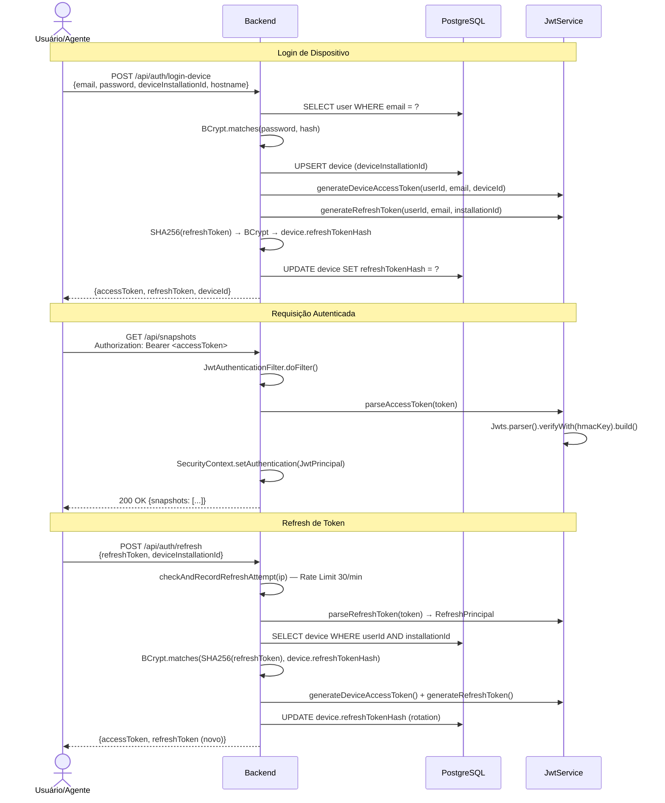
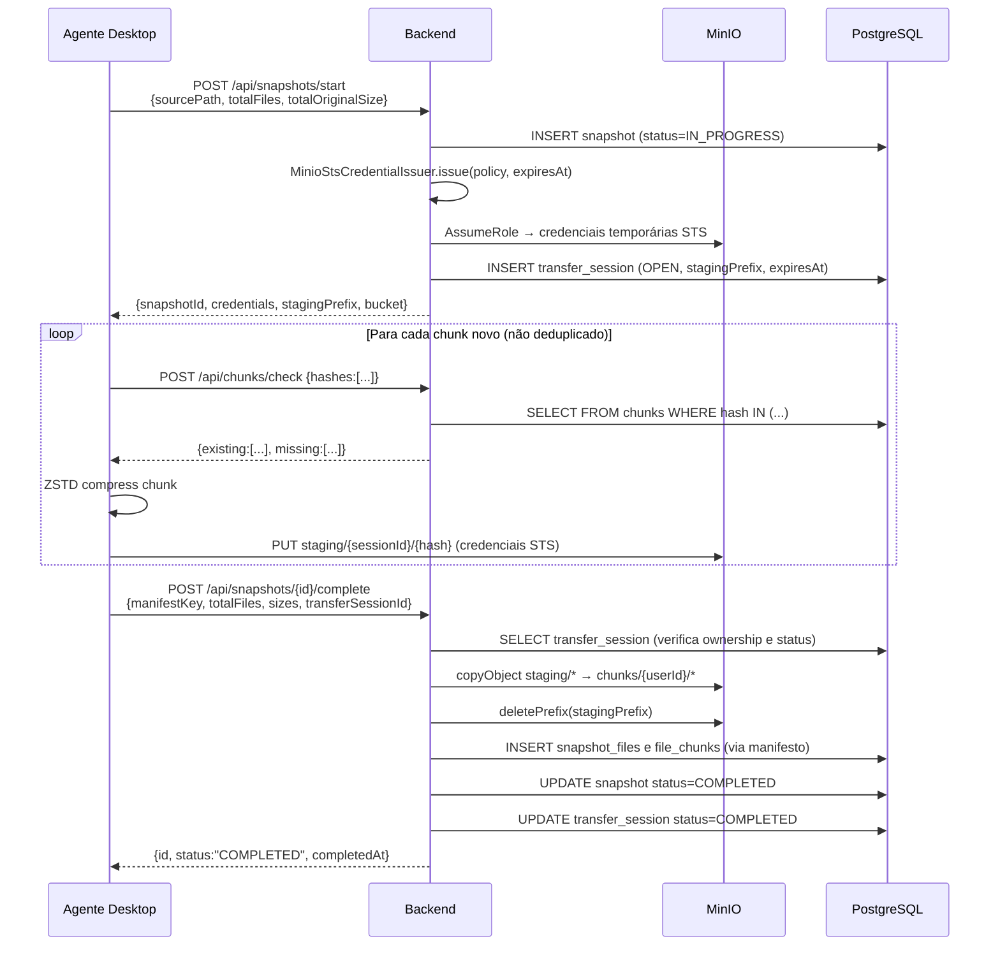
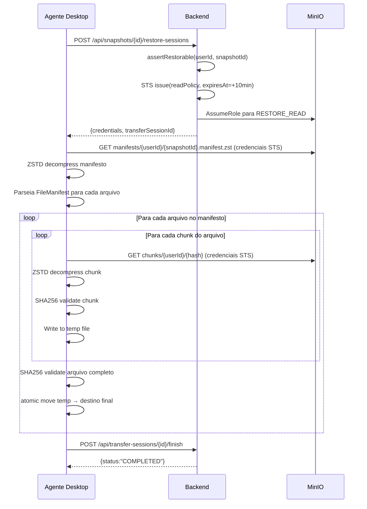

# Backend Keeply — Documentação Técnica Completa

> **Stack:** Spring Boot 3.x · Java 21 · PostgreSQL 16 · MinIO · Flyway · JWT (JJWT) · Prometheus · Caffeine Cache

---

## 1. Visão Geral da Arquitetura

O backend do Keeply é uma API REST stateless construída com Spring Boot 3 e Java 21. Ele orquestra todo o ciclo de vida de backups: autenticação de usuários e dispositivos, criação e conclusão de snapshots, coordenação de sessões de transferência MinIO (STS credentials), leitura de manifestos e streaming de arquivos para download.



### Stack Tecnológica

| Tecnologia | Versão | Motivo |
|-----------|--------|--------|
| Java | 21 | Virtual threads, records, pattern matching |
| Spring Boot | 3.x | Ecossistema maduro, auto-config |
| Spring Data JPA | 3.x | ORM com Hibernate 6 |
| Spring Security | 6.x | Filtro JWT, CORS, CSRF desabilitado |
| JJWT | 0.12.x | JWT signing HMAC-SHA256 |
| Flyway | 10.x | Migrações versionadas do schema |
| MinIO SDK | 8.x | Cliente S3-compatible |
| OkHttp | 4.x | HTTP client com timeouts configuráveis |
| Caffeine | 3.x | Cache in-memory para Rate Limiting |
| Prometheus Micrometer | — | Métricas expostas em /actuator/prometheus |
| PostgreSQL | 16 | ACID, UUID nativo, JSONB |

---

## 2. Estrutura de Packages

```
com.keeply.backend
├── BackendApplication.java          ← Entry point Spring Boot
├── config/
│   ├── JacksonConfig.java           ← ObjectMapper customizado
│   ├── MinioConfig.java             ← MinioClient bean com OkHttp timeouts
│   └── SecurityConfig.java          ← Filtros JWT, CORS, regras de acesso
├── controller/
│   ├── AiController.java            ← POST /api/ai/chat
│   ├── ApiExceptionHandler.java     ← @RestControllerAdvice global
│   ├── AuthController.java          ← /api/auth/*
│   ├── ChunkController.java         ← /api/chunks/*
│   ├── DeviceController.java        ← /api/devices/*
│   ├── SnapshotController.java      ← /api/snapshots/*
│   └── TransferSessionController.java ← /api/transfer-sessions/*
├── dto/                             ← Records imutáveis de request/response
├── exception/                       ← ForbiddenException, NotFoundException, UnauthorizedException
├── model/                           ← Entidades JPA (@Entity)
├── repository/                      ← Interfaces Spring Data JPA
├── security/
│   ├── JwtAuthenticationFilter.java ← Extrai/valida JWT de cada request
│   ├── JwtPrincipal.java            ← Record: userId, email, deviceId
│   ├── JwtService.java              ← Gera e valida tokens HMAC-SHA256
│   └── TraceIdFilter.java           ← Adiciona X-Trace-Id nos logs
├── service/                         ← Lógica de negócio
└── util/
    └── CurrentUser.java             ← Helper para pegar JwtPrincipal do SecurityContext
```

---

## 3. Todos os Endpoints REST

### 3.1 Autenticação — `/api/auth`

#### `POST /api/auth/register`
Cria uma nova conta de usuário. Requer código de registro quando `KEEPLY_REGISTRATION_CODE` está configurado.

**Autenticação:** Nenhuma

**Request:**
```json
{
  "name": "João Silva",
  "email": "joao@exemplo.com",
  "password": "MinhaSenh@123",
  "registrationCode": "codigo-secreto"
}
```

**Response `200`:**
```json
{
  "accessToken": "eyJhbGc...",
  "refreshToken": null,
  "userId": "550e8400-e29b-41d4-a716-446655440000",
  "email": "joao@exemplo.com",
  "deviceId": null
}
```

**Erros:**
- `400` — email já cadastrado, senha fraca, código inválido
- `400` — `"Registro desabilitado"` se `registrationCode` vazio no servidor

```bash
curl -X POST http://localhost:8080/api/auth/register \
  -H 'Content-Type: application/json' \
  -d '{
    "name": "João Silva",
    "email": "joao@exemplo.com",
    "password": "MinhaSenh@123",
    "registrationCode": "codigo-secreto"
  }'
```

---

#### `POST /api/auth/login`
Login humano (web/mobile). Retorna apenas access token (sem refresh — sem deviceId).

**Autenticação:** Nenhuma  
**Rate Limit:** 5 tentativas / 15 min por IP · 5 tentativas / 15 min por email

**Request:**
```json
{
  "email": "joao@exemplo.com",
  "password": "MinhaSenh@123"
}
```

**Response `200`:**
```json
{
  "accessToken": "eyJhbGc...",
  "refreshToken": null,
  "userId": "550e8400-...",
  "email": "joao@exemplo.com",
  "deviceId": null
}
```

**Erros:**
- `400` — `"Credenciais invalidas"` (mensagem genérica — VULN-008)
- `429` — Rate limit atingido

```bash
curl -X POST http://localhost:8080/api/auth/login \
  -H 'Content-Type: application/json' \
  -d '{"email":"joao@exemplo.com","password":"MinhaSenh@123"}'
```

---

#### `POST /api/auth/login-device`
Login do agente desktop. Cria/atualiza o registro do dispositivo e retorna access token + refresh token.

**Autenticação:** Nenhuma  
**Rate Limit:** Igual ao login

**Request:**
```json
{
  "email": "joao@exemplo.com",
  "password": "MinhaSenh@123",
  "deviceInstallationId": "uuid-unico-da-instalacao",
  "hostname": "meu-pc",
  "osName": "Linux 6.1",
  "agentVersion": "1.0.0"
}
```

**Response `200`:**
```json
{
  "accessToken": "eyJhbGc...",
  "refreshToken": "eyJhbGc...",
  "userId": "550e8400-...",
  "email": "joao@exemplo.com",
  "deviceId": "660e8400-..."
}
```

**Comportamento:** Se o `deviceInstallationId` já existe, atualiza o dispositivo (upsert). O refresh token é hasheado (SHA-256 → BCrypt) antes de salvar no banco.

```bash
curl -X POST http://localhost:8080/api/auth/login-device \
  -H 'Content-Type: application/json' \
  -d '{
    "email":"joao@exemplo.com",
    "password":"MinhaSenh@123",
    "deviceInstallationId":"a1b2c3d4-e5f6-...",
    "hostname":"meu-pc",
    "osName":"Linux 6.1",
    "agentVersion":"1.0.0"
  }'
```

---

#### `POST /api/auth/refresh`
Renova o access token usando o refresh token. Usa refresh token rotation (emite novo refresh a cada chamada).

**Autenticação:** Nenhuma  
**Rate Limit:** 30 tentativas / 1 min por IP

**Request:**
```json
{
  "refreshToken": "eyJhbGc...",
  "deviceInstallationId": "uuid-unico-da-instalacao"
}
```

**Response `200`:**
```json
{
  "accessToken": "eyJhbGc...",
  "refreshToken": "eyJhbGc...",
  "userId": "550e8400-...",
  "email": "joao@exemplo.com",
  "deviceId": "660e8400-..."
}
```

**Segurança:** O `deviceInstallationId` do request deve coincidir com o do JWT. O hash do refresh token armazenado é verificado com BCrypt.

```bash
curl -X POST http://localhost:8080/api/auth/refresh \
  -H 'Content-Type: application/json' \
  -d '{"refreshToken":"eyJhbGc...","deviceInstallationId":"a1b2c3d4-..."}'
```

---

### 3.2 Dispositivos — `/api/devices`

#### `GET /api/devices`
Lista todos os dispositivos do usuário autenticado.

**Autenticação:** Bearer token (access)

**Response `200`:**
```json
{
  "devices": [
    {
      "id": "660e8400-...",
      "name": "meu-pc",
      "hostname": "meu-pc",
      "osName": "Linux 6.1",
      "agentVersion": "1.0.0",
      "lastSeenAt": "2026-06-11T23:00:00Z",
      "createdAt": "2026-01-01T10:00:00Z"
    }
  ]
}
```

```bash
curl http://localhost:8080/api/devices \
  -H 'Authorization: Bearer eyJhbGc...'
```

---

#### `POST /api/devices/{id}/heartbeat`
Atualiza o `lastSeenAt` do dispositivo. Chamado periodicamente pelo agente.

**Autenticação:** Bearer token de dispositivo (com `deviceId`)

```bash
curl -X POST http://localhost:8080/api/devices/660e8400-.../heartbeat \
  -H 'Authorization: Bearer eyJhbGc...'
```

---

#### `GET /api/devices/{id}/plan`
Retorna o plano de proteção (backup plan) do dispositivo.

**Autenticação:** Bearer token

**Response `200`:**
```json
{
  "id": "770e8400-...",
  "deviceId": "660e8400-...",
  "sourcePath": "/home/joao/documentos",
  "scheduleCron": "0 2 * * *",
  "cdpEnabled": false,
  "encryptionEnabled": false,
  "retentionMode": "KEEP_ALL",
  "retentionDays": null,
  "validationEnabled": false
}
```

```bash
curl http://localhost:8080/api/devices/660e8400-.../plan \
  -H 'Authorization: Bearer eyJhbGc...'
```

---

### 3.3 Snapshots — `/api/snapshots`

#### `POST /api/snapshots/start`
Inicia um novo snapshot de backup. Cria o snapshot em status `IN_PROGRESS` e abre uma TransferSession `BACKUP_UPLOAD` com credenciais STS do MinIO.

**Autenticação:** Bearer token de dispositivo

**Request:**
```json
{
  "sourcePath": "/home/joao/documentos",
  "totalFiles": 1250,
  "totalOriginalSize": 524288000
}
```

**Response `200`:**
```json
{
  "snapshotId": "880e8400-...",
  "transferSessionId": "990e8400-...",
  "stagingPrefix": "staging/990e8400-.../",
  "credentials": {
    "accessKey": "tmp-access-key",
    "secretKey": "tmp-secret-key",
    "sessionToken": "tmp-session-token",
    "expiresAt": "2026-06-11T23:10:00Z"
  },
  "minioEndpoint": "http://minio:9000",
  "bucket": "keeply"
}
```

```bash
curl -X POST http://localhost:8080/api/snapshots/start \
  -H 'Authorization: Bearer eyJhbGc...' \
  -H 'Content-Type: application/json' \
  -d '{"sourcePath":"/home/joao/docs","totalFiles":1250,"totalOriginalSize":524288000}'
```

---

#### `POST /api/snapshots/{id}/complete`
Conclui o snapshot. O backend promove os objetos do staging para produção no MinIO e muda o status para `COMPLETED`.

**Autenticação:** Bearer token de dispositivo

**Request:**
```json
{
  "transferSessionId": "990e8400-...",
  "manifestKey": "manifests/550e8400.../880e8400....manifest.zst",
  "totalFiles": 1250,
  "totalOriginalSize": 524288000,
  "totalCompressedSize": 312000000
}
```

**Response `200`:**
```json
{
  "id": "880e8400-...",
  "status": "COMPLETED",
  "completedAt": "2026-06-11T23:05:30Z"
}
```

```bash
curl -X POST http://localhost:8080/api/snapshots/880e8400-.../complete \
  -H 'Authorization: Bearer eyJhbGc...' \
  -H 'Content-Type: application/json' \
  -d '{"transferSessionId":"990e8400-...","manifestKey":"manifests/...","totalFiles":1250,"totalOriginalSize":524288000,"totalCompressedSize":312000000}'
```

---

#### `POST /api/snapshots/{id}/fail`
Marca o snapshot como falho. Cancela a TransferSession e limpa o staging.

**Request:**
```json
{ "errorMessage": "Arquivo ilegível: /home/joao/docs/secreto.db" }
```

```bash
curl -X POST http://localhost:8080/api/snapshots/880e8400-.../fail \
  -H 'Authorization: Bearer eyJhbGc...' \
  -H 'Content-Type: application/json' \
  -d '{"errorMessage":"Arquivo ilegível"}'
```

---

#### `GET /api/snapshots`
Lista snapshots do usuário, paginado.

**Query params:** `page` (default 0), `size` (default 50, max 200)

**Response `200`:**
```json
{
  "snapshots": [...],
  "page": 0,
  "size": 50,
  "total": 123
}
```

```bash
curl 'http://localhost:8080/api/snapshots?page=0&size=20' \
  -H 'Authorization: Bearer eyJhbGc...'
```

---

#### `GET /api/snapshots/{id}/files`
Lista arquivos de um snapshot com paginação, busca e filtro por prefixo (pasta).

**Query params:** `page`, `size` (max 200), `search`, `prefix`

```bash
curl 'http://localhost:8080/api/snapshots/880e8400-.../files?prefix=/home/joao/docs/&page=0&size=100' \
  -H 'Authorization: Bearer eyJhbGc...'
```

---

#### `GET /api/snapshots/{id}/nodes`
Lista nós de um diretório (navegação em árvore), com prefixo opcional.

```bash
curl 'http://localhost:8080/api/snapshots/880e8400-.../nodes?prefix=/home/joao/' \
  -H 'Authorization: Bearer eyJhbGc...'
```

---

#### `GET /api/snapshots/{id}/files/download`
Download de um arquivo individual do snapshot. O backend lê os chunks do MinIO, descomprime ZSTD e serve como stream HTTP.

**Rate Limit:** 10 downloads / 5 min por usuário  
**Query param:** `path` — caminho relativo do arquivo no snapshot

```bash
curl 'http://localhost:8080/api/snapshots/880e8400-.../files/download?path=documentos/relatorio.pdf' \
  -H 'Authorization: Bearer eyJhbGc...' \
  -o relatorio.pdf
```

---

#### `POST /api/snapshots/{id}/archive-selected`
Download de múltiplos arquivos como ZIP em streaming.

**Rate Limit:** 1 archive download / 10 min por usuário

**Request:**
```json
{ "paths": ["documentos/relatorio.pdf", "fotos/ferias.jpg"] }
```

```bash
curl -X POST 'http://localhost:8080/api/snapshots/880e8400-.../archive-selected' \
  -H 'Authorization: Bearer eyJhbGc...' \
  -H 'Content-Type: application/json' \
  -d '{"paths":["documentos/relatorio.pdf","fotos/ferias.jpg"]}' \
  -o arquivos.zip
```

---

#### `POST /api/snapshots/{id}/restore-sessions`
Abre uma sessão de restore (TransferSession tipo `RESTORE_READ`) para o agente ler chunks do MinIO diretamente com credenciais STS.

**Autenticação:** Bearer token de **dispositivo** (exige `deviceId`)

**Response `200`:**
```json
{
  "transferSessionId": "aaa0e8400-...",
  "accessKey": "tmp-restore-key",
  "secretKey": "tmp-restore-secret",
  "sessionToken": "tmp-restore-token",
  "expiresAt": "2026-06-11T23:10:00Z",
  "minioEndpoint": "http://minio:9000",
  "bucket": "keeply"
}
```

```bash
curl -X POST http://localhost:8080/api/snapshots/880e8400-.../restore-sessions \
  -H 'Authorization: Bearer eyJhbGc...'
```

---

#### `DELETE /api/snapshots/{id}`
Apaga o snapshot, seus arquivos, chunks órfãos e objetos no MinIO.

```bash
curl -X DELETE http://localhost:8080/api/snapshots/880e8400-... \
  -H 'Authorization: Bearer eyJhbGc...'
```

---

### 3.4 Chunks — `/api/chunks`

#### `POST /api/chunks/check`
Verifica quais hashes de chunk já existem no servidor (deduplicação). O agente envia lotes de hashes e recebe quais já estão armazenados.

**Request:**
```json
{ "hashes": ["sha256hash1", "sha256hash2", "sha256hash3"] }
```

**Response `200`:**
```json
{
  "existing": [
    { "hash": "sha256hash1", "originalSize": 131072, "compressionAlgorithm": "ZSTD", "compressionLevel": 3 }
  ],
  "missing": ["sha256hash2", "sha256hash3"]
}
```

```bash
curl -X POST http://localhost:8080/api/chunks/check \
  -H 'Authorization: Bearer eyJhbGc...' \
  -H 'Content-Type: application/json' \
  -d '{"hashes":["abc123...","def456..."]}'
```

---

#### `GET /api/chunks/storage-usage`
Retorna uso total de armazenamento do usuário.

```bash
curl http://localhost:8080/api/chunks/storage-usage \
  -H 'Authorization: Bearer eyJhbGc...'
```

**Response `200`:**
```json
{ "totalOriginalBytes": 10737418240, "totalCompressedBytes": 6442450944 }
```

---

### 3.5 Transfer Sessions — `/api/transfer-sessions`

#### `POST /api/transfer-sessions/{id}/renew`
Renova as credenciais STS de uma sessão ativa antes de expirar.

```bash
curl -X POST http://localhost:8080/api/transfer-sessions/990e8400-.../renew \
  -H 'Authorization: Bearer eyJhbGc...'
```

---

#### `POST /api/transfer-sessions/{id}/cancel`
Cancela a sessão e limpa o staging prefix no MinIO.

```bash
curl -X POST http://localhost:8080/api/transfer-sessions/990e8400-.../cancel \
  -H 'Authorization: Bearer eyJhbGc...'
```

---

#### `POST /api/transfer-sessions/{id}/finish`
Conclui a sessão (normalmente chamado internamente pelo complete do snapshot).

```bash
curl -X POST http://localhost:8080/api/transfer-sessions/990e8400-.../finish \
  -H 'Authorization: Bearer eyJhbGc...'
```

---

### 3.6 IA — `/api/ai`

#### `POST /api/ai/chat`
Chat com o assistente Keeply (Nemotron-3-Super via OpenRouter).

**Autenticação:** Bearer token  
**Requer:** `KEEPLY_AI_API_KEY` configurado

**Request:**
```json
{
  "message": "Como faço para restaurar um arquivo específico de um snapshot?",
  "history": [
    { "role": "user", "content": "Tenho um snapshot de ontem" },
    { "role": "assistant", "content": "Ótimo! O que você precisa restaurar?" }
  ]
}
```

**Limites:** `message` máx 4000 chars · `history` máx 8 mensagens · cada history item máx 4000 chars

**Response `200`:**
```json
{
  "answer": "Para restaurar um arquivo específico:\n1. Abra o snapshot desejado na seção Atividades\n2. Navegue até a pasta do arquivo\n3. Clique em 'Download' ao lado do arquivo\n4. Salve em local seguro antes de substituir o original",
  "model": "nvidia/nemotron-3-super-120b-a12b:free"
}
```

```bash
curl -X POST http://localhost:8080/api/ai/chat \
  -H 'Authorization: Bearer eyJhbGc...' \
  -H 'Content-Type: application/json' \
  -d '{"message":"Como faço restore de um arquivo?","history":[]}'
```

---

### 3.7 Actuator — Saúde e Métricas

#### `GET /actuator/health`
```bash
curl http://localhost:8080/actuator/health
# {"status":"UP"}
```

#### `GET /actuator/prometheus`
Métricas no formato Prometheus. **Bloqueado pelo Nginx em produção.**

```bash
curl http://localhost:8080/actuator/prometheus
```

---

## 4. Fluxo de Autenticação JWT



### Claims do JWT

| Claim | Tipo | Descrição |
|-------|------|-----------|
| `sub` | UUID string | userId |
| `email` | string | Email do usuário |
| `typ` | string | `"access"` ou `"refresh"` |
| `deviceId` | UUID string | Presente em tokens de dispositivo |
| `installationId` | string | Presente em refresh tokens |
| `iat` | epoch | Emitido em |
| `exp` | epoch | Expira em |

**Access token:** 120 minutos · **Refresh token:** 30 dias

---

## 5. Sistema de Rate Limiting

Implementado com **Caffeine** (cache in-memory com TTL automático).

> ⚠️ **VULN-005:** Rate limiting IN-MEMORY. Em produção multi-instância, contadores são independentes por réplica. Use Redis ou rate limit no Nginx/API Gateway para clusters.

### Limites Configuráveis

| Tipo | Padrão | Janela | Variável de Ambiente |
|------|--------|--------|---------------------|
| Login por IP | 5 tentativas | 15 min | `KEEPLY_RATE_LOGIN_IP_MAX_ATTEMPTS` / `_WINDOW_MINUTES` |
| Login por email | 5 tentativas | 15 min | `KEEPLY_RATE_LOGIN_EMAIL_MAX_ATTEMPTS` / `_WINDOW_MINUTES` |
| Refresh por IP | 30 tentativas | 1 min | `KEEPLY_RATE_REFRESH_IP_MAX_ATTEMPTS` |
| Download arquivo por user | 10 downloads | 5 min | `KEEPLY_RATE_DOWNLOAD_FILE_USER_MAX_ATTEMPTS` / `_WINDOW_MINUTES` |
| Download archive por user | 1 download | 10 min | `KEEPLY_RATE_DOWNLOAD_ARCHIVE_USER_MAX_ATTEMPTS` / `_WINDOW_MINUTES` |

### Como Funciona

```java
// Caffeine cache com TTL automático
Cache<String, AtomicInteger> ipCache = Caffeine.newBuilder()
    .expireAfterWrite(Duration.ofMinutes(loginIpWindowMinutes))
    .build();

// Ao falhar: incrementa contador
incrementAttempts(ipCache, ip);

// Ao verificar: lê sem incrementar
int attempts = getAttempts(ipCache, ip);
if (attempts >= maxAttempts) throw new RateLimitException(...);

// Ao ter sucesso: invalida (reset) o contador por email
emailCache.invalidate(email);
```

---

## 6. Fluxo de Backup



---

## 7. Fluxo de Restore



---

## 8. Sistema de Audit Log

O `AuditLog` é registrado de forma assíncrona usando um `ExecutorService` com pool de threads configurável.

**Eventos auditados:**
| Evento | Quando |
|--------|--------|
| `LOGIN_SUCCESS` | Login web/API bem-sucedido |
| `LOGIN_FAILED` | Credenciais inválidas |
| `DEVICE_LOGIN_SUCCESS` | Login de dispositivo |
| `REFRESH_FAILED` | Tentativa de refresh com token revogado |
| `SNAPSHOT_STARTED` | Início de backup |
| `SNAPSHOT_COMPLETED` | Backup concluído |
| `SNAPSHOT_FAILED` | Backup falhou |
| `SNAPSHOT_DELETED` | Snapshot apagado |

**Workers assíncronos:** configurável via `KEEPLY_AUDIT_WORKERS` (padrão: 4) e `KEEPLY_AUDIT_QUEUE_SIZE` (padrão: 16).

---

## 9. Configuração via Variáveis de Ambiente

| Variável | Padrão Local | Obrigatório Prod | Descrição |
|----------|-------------|-----------------|-----------|
| `SPRING_DATASOURCE_URL` | `jdbc:postgresql://localhost:5432/keeply` | ✅ | URL JDBC do PostgreSQL |
| `SPRING_DATASOURCE_USERNAME` | `keeply` | ✅ | Usuário do banco |
| `SPRING_DATASOURCE_PASSWORD` | — | ✅ | Senha do banco |
| `KEEPLY_JWT_SECRET` | — | ✅ | Segredo HMAC (mín 32 bytes) |
| `KEEPLY_MASTER_KEY` | — | ✅ | Chave mestra (64 hex chars) |
| `KEEPLY_MINIO_ENDPOINT` | `http://localhost:9000` | ✅ | URL interna do MinIO |
| `KEEPLY_MINIO_PUBLIC_ENDPOINT` | `http://localhost:9000` | ✅ | URL pública do MinIO |
| `KEEPLY_MINIO_ACCESS_KEY` | `keeply` | ✅ | Root user MinIO |
| `KEEPLY_MINIO_SECRET_KEY` | — | ✅ | Root password MinIO |
| `KEEPLY_MINIO_BUCKET` | `keeply` | — | Nome do bucket |
| `KEEPLY_REGISTRATION_CODE` | (vazio = desabilitado) | ⚠️ | Código para novos cadastros |
| `KEEPLY_ALLOWED_ORIGINS` | `http://localhost:*` | ✅ | CORS — domínios permitidos |
| `KEEPLY_TRUST_PROXY_HEADERS` | `false` | ✅ | `true` atrás de Nginx |
| `KEEPLY_AI_BASE_URL` | `https://openrouter.ai/api/v1` | — | URL da API de IA |
| `KEEPLY_AI_MODEL` | `nvidia/nemotron-3-super-120b-a12b:free` | — | Modelo de IA |
| `KEEPLY_AI_API_KEY` | (vazio) | ✅ para IA | API key do OpenRouter |
| `KEEPLY_AI_TIMEOUT_SECONDS` | `60` | — | Timeout da chamada IA |
| `KEEPLY_TRANSFER_CREDENTIAL_LIFETIME_MINUTES` | `10` | — | Duração das credenciais STS |
| `JAVA_TOOL_OPTIONS` | — | — | `-Xms256m -Xmx512m` (local) |

---

## 10. Segurança — VULNs e Mitigações

| ID | Vulnerabilidade | Mitigação |
|----|----------------|-----------|
| VULN-004 | Thread starvation por MinIO lento | OkHttpClient com `connectTimeout=5s`, `writeTimeout=30s`, `readTimeout=120s` |
| VULN-004 | Timeout de async request | `spring.mvc.async.request-timeout=300000` (5 min) |
| VULN-005 | Rate limiting sem estado distribuído | Caffeine in-memory; aviso de startup para usar Redis em clusters |
| VULN-008 | Enumeração de emails | Mensagem genérica `"Credenciais invalidas"` independente do motivo |
| VULN-018 | Lost updates em snapshots concorrentes | `@Version` (optimistic locking) em `Snapshot` e `TransferSession` |
| — | Path traversal no restore | Validação de caminhos relativos no manifesto; bloqueio de `..` |
| — | Acesso cross-user | Verificação de `userId` em todos os queries de snapshot/chunk |
| — | Refresh token reuse | Token rotation + hash BCrypt armazenado |
| — | Prometheus exposto em prod | `/actuator/prometheus` bloqueado no Nginx (retorna 404) |

---

## 11. Dependências (build.gradle — principais)

| Dependência | Versão | Finalidade |
|-------------|--------|-----------|
| `spring-boot-starter-web` | 3.x | REST API, Tomcat embedded |
| `spring-boot-starter-data-jpa` | 3.x | JPA/Hibernate + Spring Data |
| `spring-boot-starter-security` | 3.x | Filtros de segurança, CORS |
| `spring-boot-starter-validation` | 3.x | Bean Validation (@NotBlank, @Size) |
| `spring-boot-starter-actuator` | 3.x | Health, Prometheus metrics |
| `micrometer-registry-prometheus` | — | Exporter Prometheus |
| `jjwt-api` + `jjwt-impl` + `jjwt-jackson` | 0.12.x | JWT geração/validação |
| `flyway-core` | 10.x | Migrações de banco |
| `postgresql` | — | Driver JDBC |
| `io.minio:minio` | 8.x | SDK MinIO/S3 |
| `com.github.luben:zstd-jni` | — | Compressão ZSTD nativa |
| `com.github.ben-manes.caffeine:caffeine` | 3.x | Cache in-memory para Rate Limit |

---

## 12. Dockerfile — Análise Linha por Linha

```dockerfile
# Stage 1: Build
FROM eclipse-temurin:21-jdk-alpine AS builder
# Java 21 JDK Alpine — imagem mínima para compilação

WORKDIR /app
COPY gradlew settings.gradle build.gradle ./
COPY gradle ./gradle
# Copia só os arquivos de build primeiro (cache de dependências Docker)

RUN ./gradlew dependencies --no-daemon
# Baixa dependências — esta camada fica em cache se build.gradle não mudar

COPY backend ./backend
COPY agent ./agent
# Copia código fonte após dependências (otimização de cache)

RUN ./gradlew :backend:bootJar --no-daemon
# Gera o fat JAR executável

# Stage 2: Runtime
FROM eclipse-temurin:21-jre-alpine
# Apenas JRE — sem JDK, imagem menor e mais segura

RUN addgroup -S keeply && adduser -S keeply -G keeply
# Usuário não-root para segurança

WORKDIR /app
COPY --from=builder /app/backend/build/libs/*.jar app.jar
# Copia apenas o JAR final do estágio de build

USER keeply
# Roda como usuário sem privilégios

EXPOSE 8080
# Documenta a porta (não abre — isso é feito pelo docker compose)

ENTRYPOINT ["java", "-jar", "app.jar"]
# Executa o Spring Boot
```

**Multi-stage build:** A imagem final contém apenas JRE + JAR (~150MB vs ~500MB com JDK).
