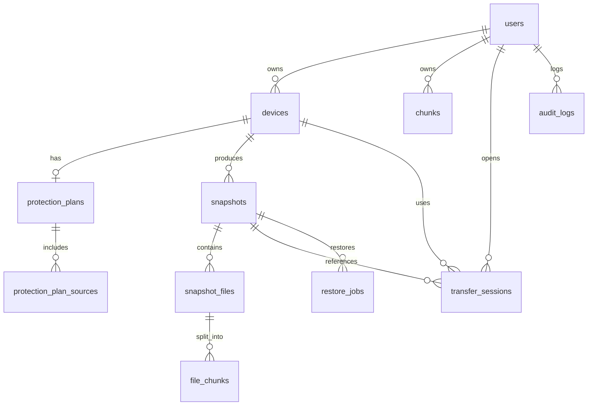

# Banco de dados Keeply

O Keeply usa PostgreSQL com migrações Flyway. O backend roda com `ddl-auto: validate`, então o schema esperado deve existir antes da aplicação subir corretamente.

## Configuração

Variáveis principais:

```dotenv
SPRING_DATASOURCE_URL=jdbc:postgresql://localhost:5432/keeply
SPRING_DATASOURCE_USERNAME=keeply
SPRING_DATASOURCE_PASSWORD=keeply123
```

No Docker Compose local, o serviço é `postgres:16` e a porta é publicada em `127.0.0.1:5432` por padrão.

## Entidades principais

| Tabela | Função |
| --- | --- |
| `users` | Usuários da plataforma. |
| `devices` | Máquinas/agentes vinculados ao usuário. |
| `protection_plans` | Configuração de proteção por dispositivo. |
| `protection_plan_sources` | Diretórios protegidos por plano. |
| `snapshots` | Execuções de backup e estado do snapshot. |
| `snapshot_files` | Arquivos contidos em cada snapshot. |
| `file_chunks` | Relação entre arquivo e chunks. |
| `chunks` | Catálogo deduplicado de chunks por usuário. |
| `transfer_sessions` | Sessões temporárias de upload/restore. |
| `restore_jobs` | Registro de trabalhos de restauração. |
| `audit_logs` | Eventos de auditoria. |

## Relacionamentos



## Migrações relevantes

| Migração | Descrição |
| --- | --- |
| `V1__initial_schema.sql` | Schema inicial de usuários, dispositivos, snapshots, arquivos, chunks, sessões e auditoria. |
| `V4__optimize_snapshot_file_path_search.sql` | Habilita `pg_trgm` e índices para busca de arquivos. |
| `V5__add_chunk_compression_metadata.sql` | Adiciona metadados de compressão nos chunks. |
| `V6__harden_transfer_sessions_and_indexes.sql` | Adiciona constraints, versionamento e índices em sessões/snapshots. |
| `V7__protection_plan_settings.sql` | Adiciona CDP, criptografia, cron e senha de criptografia no plano. |
| `V8__protection_plan_retention.sql` | Adiciona retenção. |
| `V9__add_snapshot_version.sql` | Adiciona optimistic locking em snapshots. |
| `V10__restore_transfer_session_access_key.sql` | Reintroduz coluna de access key de sessão. |
| `V11__add_protection_plan_validation_flag.sql` | Adiciona flag de validação. |
| `V12__remove_backup_staging_constraint.sql` | Remove constraint rígida de staging. |
| `V13__seed_test_user.sql` | No-op; seed antigo removido. |

## Índices importantes

- `uk_users_email`: impede e-mails duplicados.
- `uk_devices_user_installation`: impede duplicidade de instalação por usuário.
- `idx_snapshot_files_path_trgm`: acelera busca textual por caminho.
- `idx_snapshot_files_snapshot_path_prefix`: acelera navegação por prefixo/pasta.
- `uk_chunks_user_hash`: base da deduplicação por usuário.
- `idx_transfer_session_user_device_status`: acelera consulta de sessão por usuário/dispositivo/status.
- `idx_snapshots_device_status_created`: acelera listagem de snapshots por dispositivo/status.

## Estados importantes

Snapshots:

```text
IN_PROGRESS -> PROCESSING -> COMPLETED
IN_PROGRESS -> FAILED
PROCESSING -> FAILED
```

Sessões de transferência:

```text
OPEN -> COMPLETED
OPEN -> FAILED
OPEN -> CANCELLED
OPEN -> EXPIRED
```

Tipos de sessão:

```text
BACKUP_UPLOAD
RESTORE_READ
```

## Reset local

Ambiente local antigo com dados incompatíveis pode ser resetado por:

```bash
./debug/reset_env.sh
```

No Windows:

```powershell
.\debug\reset_env.ps1
```

Isso remove dados de desenvolvimento. Não use em produção.

## Pontos de atenção

- `pg_trgm` precisa estar disponível no PostgreSQL para a busca otimizada.
- Chunks deduplicados são por usuário, não globais entre tenants.
- A limpeza de chunks órfãos ainda precisa de rotina dedicada.
- Alterações manuais no banco podem quebrar a relação entre manifesto, `snapshot_files`, `file_chunks` e objetos MinIO.
