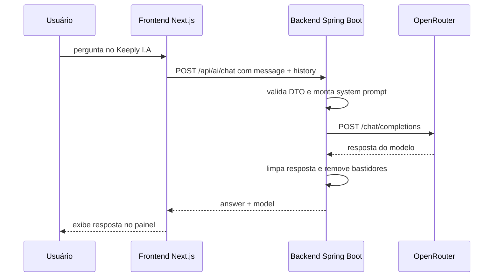

# Keeply I.A

Keeply I.A é a funcionalidade de Inteligência Artificial integrada ao painel web. Ela funciona como um assistente operacional para dúvidas sobre backup, snapshots, restauração, máquinas, segurança e diagnóstico.

## O que a funcionalidade resolve

Usuários de backup costumam ter dúvidas práticas como:

- Como verificar se meus backups estão saudáveis?
- O que fazer quando uma máquina aparece offline?
- Como restaurar um arquivo sem sobrescrever o original?
- Onde encontro snapshots e atividades recentes?
- Como interpretar falhas básicas no painel?

O Keeply I.A reduz atrito de uso porque responde essas dúvidas dentro do próprio painel, usando linguagem natural e termos do produto.

## O que ela não faz

- Não executa backup.
- Não restaura arquivos automaticamente.
- Não altera plano de proteção.
- Não acessa diretamente o banco de dados.
- Não consulta automaticamente o estado real das máquinas/snapshots.
- Não substitui alertas, validações técnicas ou observabilidade.

O prompt instrui o modelo a não inventar estados de máquinas, backups, snapshots ou arquivos quando esses dados não foram fornecidos.

## Modelo/técnica empregada

A implementação usa um **modelo de linguagem via API de terceiros**.

Configuração padrão:

```dotenv
KEEPLY_AI_BASE_URL=https://openrouter.ai/api/v1
KEEPLY_AI_MODEL=nvidia/nemotron-3-super-120b-a12b:free
KEEPLY_AI_API_KEY=sk-or-v1-sua-chave-openrouter
KEEPLY_AI_TITLE=Keeply
KEEPLY_AI_REFERER=http://localhost:3000
KEEPLY_AI_TIMEOUT_SECONDS=60
```

O backend chama a API compatível com Chat Completions do OpenRouter.

## Justificativa da escolha

A escolha de um LLM via API é adequada para esta etapa do projeto porque:

- permite entregar uma experiência conversacional sem treinar modelo próprio;
- reduz custo e complexidade de infraestrutura;
- facilita troca de modelo por variável de ambiente;
- atende bem perguntas operacionais em linguagem natural;
- é suficiente para uma demonstração acadêmica de IA aplicada ao produto.

Treinar uma rede neural própria para isso seria exagerado para o escopo atual. O problema é de assistência textual e orientação operacional, não de visão computacional ou classificação supervisionada pesada.

## Integração no código

### Frontend

Arquivo principal:

```text
frontend/src/components/KeeplyAiAssistant.tsx
```

Responsabilidades:

- Exibe botão **Keeply I.A**.
- Mantém mensagens no estado local.
- Mostra sugestões iniciais.
- Envia a pergunta e o histórico curto para o backend.
- Renderiza resposta ou erro.

Chamada:

```ts
api<AiChatResponse>("/api/ai/chat", {
  method: "POST",
  body: JSON.stringify({ message: question, history }),
});
```

### Backend

Arquivos principais:

```text
backend/src/main/java/com/keeply/backend/controller/AiController.java
backend/src/main/java/com/keeply/backend/dto/AiDtos.java
backend/src/main/java/com/keeply/backend/service/AiChatService.java
```

Fluxo:



## Contrato da API

Rota:

```http
POST /api/ai/chat
Authorization: Bearer <access-token>
Content-Type: application/json
```

Request:

```json
{
  "message": "Como restauro um arquivo de um snapshot?",
  "history": [
    { "role": "user", "content": "Tenho um backup concluído." },
    { "role": "assistant", "content": "Abra a tela de Backups e selecione o snapshot." }
  ]
}
```

Validações:

- `message` é obrigatório.
- `message` tem limite de 4000 caracteres.
- `history` tem limite de 8 mensagens.
- Cada mensagem do histórico tem limite de 4000 caracteres.

Response:

```json
{
  "answer": "Abra Backups, selecione o snapshot desejado, revise o arquivo e baixe para um local seguro antes de substituir o original.",
  "model": "nvidia/nemotron-3-super-120b-a12b:free"
}
```

## Prompt de sistema

O backend orienta o modelo a:

- responder em português do Brasil;
- usar linguagem direta;
- evitar Markdown pesado;
- ajudar com backups, máquinas, snapshots, restauração, segurança e diagnóstico;
- não mostrar raciocínio interno;
- não inventar dados de ambiente;
- orientar restauração para local seguro antes de substituir arquivos existentes.

## Demonstração recomendada

Perguntas boas para vídeo:

1. `Como verifico se meus backups estão saudáveis?`
2. `O que fazer quando uma máquina fica offline?`
3. `Como funciona a restauração de um snapshot?`
4. `Qual cuidado devo tomar antes de restaurar um arquivo?`

A demonstração deve mostrar:

1. painel aberto;
2. botão Keeply I.A;
3. pergunta digitada;
4. requisição sendo processada;
5. resposta retornada;
6. explicação rápida do fluxo frontend → backend → modelo → resposta.

## Limitações observadas

- Depende de conexão com a API externa configurada.
- Depende de `KEEPLY_AI_API_KEY`.
- Latência varia conforme o provedor/modelo.
- Não há RAG com documentação interna do projeto.
- Não há ferramentas/function calling para consultar snapshots reais.
- O histórico é curto e mantido no estado do frontend.
- O backend não registra avaliação de qualidade das respostas.

## Melhorias futuras

- Adicionar RAG com documentação do Keeply.
- Permitir que a IA consulte dados reais do usuário com ferramentas seguras e escopadas.
- Adicionar sugestões contextuais por tela do painel.
- Registrar feedback positivo/negativo nas respostas.
- Criar políticas de segurança para impedir ações destrutivas automáticas.
- Adicionar fallback quando a API externa estiver indisponível.
- Criar modo offline com respostas baseadas em documentação local.
