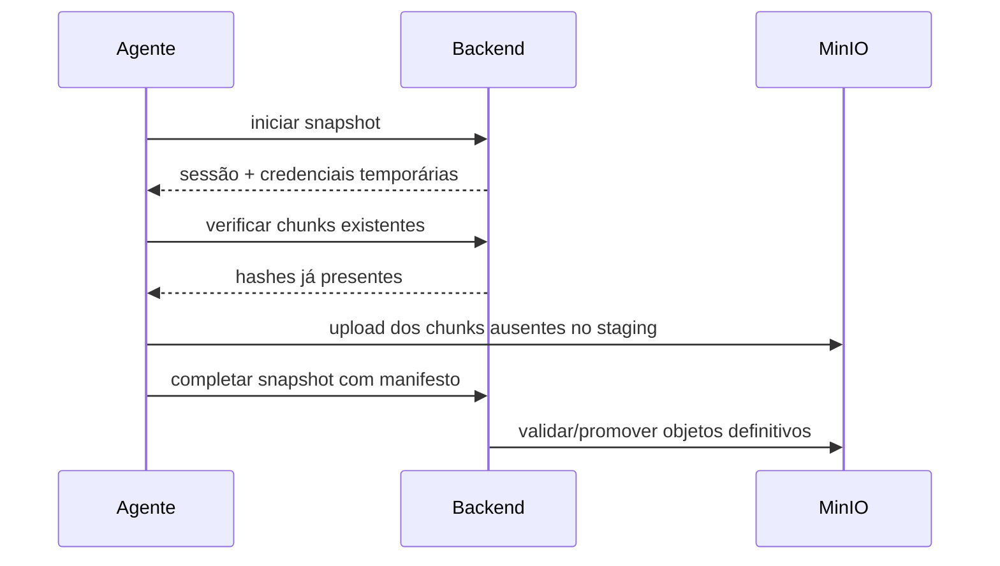

# MinIO / Object Storage

O Keeply usa MinIO como storage S3 compatível para armazenar chunks comprimidos e manifestos de snapshots.

## Papel do MinIO

O PostgreSQL guarda metadados e índices. O MinIO guarda os objetos binários:

- chunks Zstandard (`.zst`);
- manifestos de snapshots;
- objetos temporários em staging durante sessões de upload.

## Configuração local

No Compose local:

```yaml
minio:
  image: minio/minio:latest
  command: server /data --console-address ":9001"
```

Portas padrão:

| Serviço | URL |
| --- | --- |
| API S3 | `http://localhost:9000` |
| Console | `http://localhost:9001` |

Credenciais padrão de desenvolvimento:

```text
Usuário: keeply
Senha: keeply123
Bucket: keeply
```

Variáveis relevantes:

```dotenv
MINIO_ROOT_USER=keeply
MINIO_ROOT_PASSWORD=keeply123
KEEPLY_MINIO_ENDPOINT=http://localhost:9000
KEEPLY_MINIO_ACCESS_KEY=keeply
KEEPLY_MINIO_SECRET_KEY=keeply123
KEEPLY_MINIO_BUCKET=keeply
```

## Organização dos objetos

Estrutura esperada:

```text
users/{userId}/chunks/{aa}/{bb}/{hash}.zst
users/{userId}/manifests/{snapshotId}.json.zst
staging/{sessionId}/...
```

O particionamento `{aa}/{bb}` evita muitos objetos no mesmo prefixo.

## Fluxo de upload



## Fluxo de restore

1. Cliente solicita sessão de restore.
2. Backend valida posse do snapshot.
3. Backend emite credenciais temporárias de leitura.
4. Cliente lê manifesto e chunks necessários.
5. Arquivo é reconstruído e validado por hash.

## Produção

Na produção, o Nginx fica na frente do MinIO. O endpoint público configurado no Compose é:

```dotenv
KEEPLY_MINIO_PUBLIC_ENDPOINT=https://keeply.app.br
```

Clientes S3 geralmente não aceitam endpoint com subpath arbitrário. Se alterar o proxy, valide upload, download, assinatura e renovação de credenciais antes de usar com dados reais.

## Riscos e cuidados

- Não exponha o console MinIO publicamente sem autenticação forte.
- Não use credenciais `keeply/keeply123` fora de desenvolvimento.
- Mantenha PostgreSQL e MinIO consistentes; remover objetos manualmente pode quebrar restores.
- O projeto ainda precisa de rotina de limpeza de chunks órfãos.
- Backups do próprio MinIO precisam ser planejados em produção.
