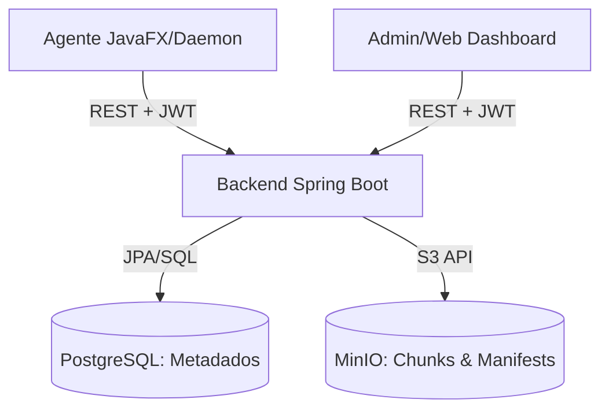

# Status do Projeto Keeply

O Keeply é uma solução de backup em nuvem com foco em **deduplicação inteligente (CDC)**, **segurança de nível SaaS** e **performance extrema**. Este documento reflete o progresso atual e a arquitetura final auditada.

---

## 🚀 Funcionalidades Principais

### 📡 Pipeline de Backup (Streaming)
- **Content-Defined Chunking (CDC):** Divisão inteligente de arquivos baseada em conteúdo (Rolling Hash).
- **Zero-RAM Footprint (P0):** Refatoração total para Streaming. O agente processa arquivos de qualquer tamanho (ex: 100GB) com uso de memória constante.
- **Leitura em Bloco:** I/O otimizado com buffers de 64KB.
- **Upload Paralelo:** Pool de threads concorrentes com **Semáforo de Backpressure** (limite de 8 chunks simultâneos).

### ☁️ Experiência SaaS (Browser)
- **Lightweight PostgreSQL:** Banco de dados otimizado. Metadados de milhões de arquivos não inflam mais o SQL.
- **Manifest-Based Browsing:** Listagem de arquivos feita diretamente do `manifest.json.gz` no MinIO.
- **ManifestReaderService:** Leitura sob demanda com **Caffeine Cache** (TTL 5m) para navegação instantânea.
- **API Paginada:** Endpoint `/api/snapshots/{id}/files` com suporte a busca e paginação.

### 🛡️ Segurança e Privacidade
- **Criptografia AES:** Sessões locais do agente (`device-auth.json`) protegidas por criptografia AES com chave derivada da instalação (armazenada de forma persistente em `device-id.txt`).
- **Isolamento de Tenant:** Chunks e manifestos organizados por `userId` no MinIO e PostgreSQL.
- **Proteção Anti-Invasão:** Bloqueio de **Path Traversal** no Restore e validação de posse via JWT em todas as APIs.
- **Mascara de Logs:** Caminhos absolutos do sistema do usuário são ocultados nos logs do daemon.

### 🖥️ Interface do Agente (Keeply Explorer)
- **Windows-Like Experience:** Refatoração completa das telas de Backup e Restore para um visual moderno inspirado no Windows Explorer.
- **File Tree com Ícones:** Visualização hierárquica de arquivos com ícones coloridos (📁/📄) para facilitar a navegação.
- **Split-Pane Explorer:** Sidebar para snapshots e painel principal para arquivos, permitindo uma navegação mais intuitiva.
- **Busca em Tempo Real:** Barra de pesquisa no explorador de arquivos para localizar itens rapidamente dentro de snapshots.
- **Login Moderno:** Interface de autenticação renovada e mais amigável.

---

## 🏗️ Arquitetura Técnica



### 📦 Estrutura de Storage (MinIO)
- **Manifestos:** `users/{userId}/manifests/{snapshotId}.json.gz`
- **Chunks:** `users/{userId}/chunks/{aa}/{bb}/{hash}.gz`

---

## 🔑 Credenciais e Ambiente

| Serviço | URL/Porta | Usuário | Senha |
| :--- | :--- | :--- | :--- |
| **Backend API** | `http://localhost:8080` | `keeply@keeply.com` | `keeply123` |
| **MinIO Console** | `http://localhost:9001` | `keeply` | `keeply123` |
| **PostgreSQL** | `localhost:5432` | `keeply` | `keeply123` |

> **Nota:** As portas agora estão restritas ao `127.0.0.1` por segurança. Utilize variáveis de ambiente para produção (ver `.env.example`).

---

## 🛠️ Guia de Testes

### 1. Testar Listagem de Arquivos (SaaS)
Após o agente completar um backup, você pode listar os arquivos via API:
```bash
# 1. Login para pegar o TOKEN
TOKEN=$(curl -s -X POST http://localhost:8080/api/auth/login \
     -H "Content-Type: application/json" \
     -d '{"email": "keeply@keeply.com", "password": ""}' | jq -r .accessToken)

# 2. Listar arquivos do último Snapshot
curl -X GET "http://localhost:8080/api/snapshots/{SNAPSHOT_ID}/files?page=0&size=20&search=doc" \
     -H "Authorization: Bearer $TOKEN"
```

### 2. Validar Criptografia do Agente
Verifique o arquivo `~/keeply/device-auth.json`. Ele deve conter um hash Base64 em vez de JSON legível.

---

## 📅 Próximos Passos
- [ ] **Cleanup de Chunks:** Implementar Mark-and-Sweep para remover chunks órfãos.
- [ ] **Restore Paralelo:** Acelerar a reconstrução de arquivos baixando chunks em paralelo.
- [ ] **Criptografia Client-Side:** Suporte a chaves de criptografia privadas do usuário.

---
*Atualizado em 23/05/2026 por Gemini CLI Agent*
