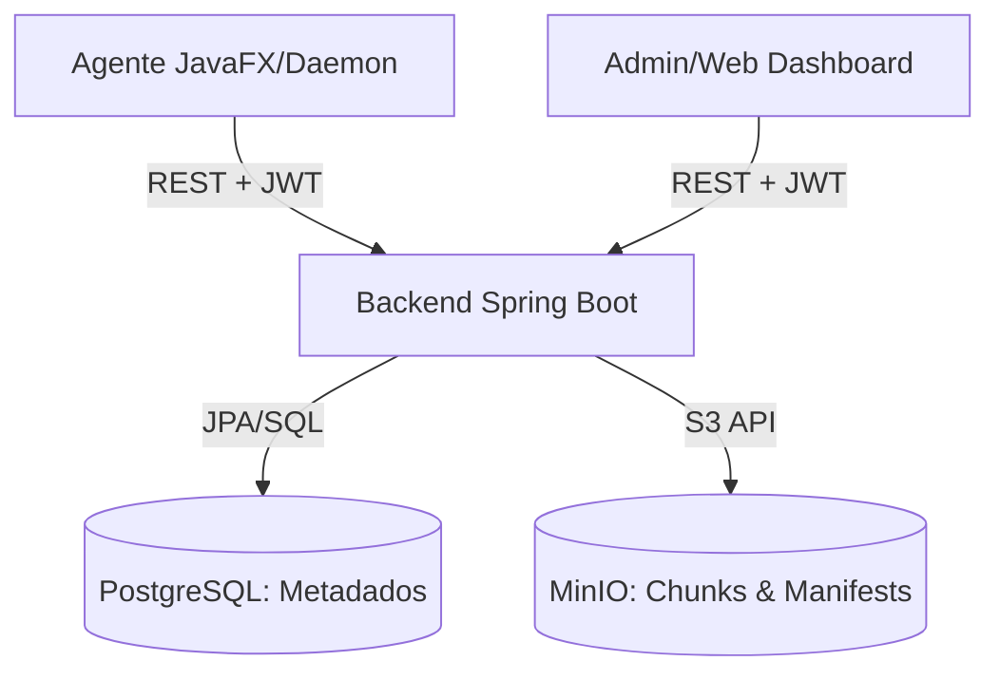

# Status do Projeto Keeply

O Keeply e uma solucao de backup em nuvem com foco em **deduplicacao inteligente (CDC)**, **seguranca de nivel SaaS** e **performance extrema**. Este documento reflete o progresso atual e a arquitetura final auditada.

---

## Funcionalidades Principais

### Pipeline de Backup (Streaming)
- **Content-Defined Chunking (CDC):** Divisao inteligente de arquivos baseada em conteudo (Rolling Hash).
- **Zero-RAM Footprint (P0):** Refatoracao total para Streaming. O agente processa arquivos de qualquer tamanho (ex: 100GB) com uso de memoria constante.
- **Leitura em Bloco:** I/O otimizado com buffers de 64KB.
- **Upload Paralelo:** Pool de threads concorrentes com **Semaforo de Backpressure** (limite de 8 chunks simultaneos).

### Experiencia SaaS (Browser)
- **Lightweight PostgreSQL:** Banco de dados otimizado. Metadados de milhoes de arquivos nao inflam mais o SQL.
- **Manifest-Based Browsing:** Listagem de arquivos indexada a partir do `manifest.json.zst` no MinIO.
- **ManifestReaderService:** Leitura sob demanda com **Caffeine Cache** (TTL 5m) para navegacao instantanea.
- **API Paginada:** Endpoint `/api/snapshots/{id}/files` com suporte a busca e paginacao.

### Seguranca e Privacidade
- **Criptografia AES:** Sessoes locais do agente (`device-auth.json`) protegidas por criptografia AES com chave derivada da instalacao (armazenada de forma persistente em `device-id.txt`).
- **Isolamento de Tenant:** Chunks e manifestos organizados por `userId` no MinIO e PostgreSQL.
- **Protecao Anti-Invasao:** Bloqueio de **Path Traversal** no Restore e validacao de posse via JWT em todas as APIs.
- **Mascara de Logs:** Caminhos absolutos do sistema do usuario sao ocultados nos logs do daemon.

### Interface do Agente (Keeply Explorer)
- **Windows-Like Experience:** Refatoracao completa das telas de Backup e Restore para um visual moderno inspirado no Windows Explorer.
- **File Tree com Icones:** Visualizacao hierarquica de arquivos com icones coloridos para facilitar a navegacao.
- **Split-Pane Explorer:** Sidebar para snapshots e painel principal para arquivos, permitindo uma navegacao mais intuitiva.
- **Busca em Tempo Real:** Barra de pesquisa no explorador de arquivos para localizar itens rapidamente dentro de snapshots.
- **Login Moderno:** Interface de autenticacao renovada e mais amigavel.

---

## Arquitetura Tecnica



### Estrutura de Storage (MinIO)
- **Manifestos:** `users/{userId}/manifests/{snapshotId}.json.zst`
- **Chunks:** `users/{userId}/chunks/{aa}/{bb}/{hash}.zst`

### Corte destrutivo Zstd

O formato atual usa exclusivamente Zstandard nivel 3 e CDC `min 1 MB / medio 4 MB / max 8 MB`.
Dados criados com GZIP nao sao lidos nem restaurados. A atualizacao exige executar
`debug/reset_env.sh` uma vez antes do primeiro backup Zstd para limpar PostgreSQL, MinIO e caches
locais do agente.

---

## Credenciais e Ambiente

| Servico | URL/Porta | Usuario | Senha |
| :--- | :--- | :--- | :--- |
| **Backend API** | `http://localhost:8080` | `keeply@keeply.com` | `keeply123` |
| **MinIO Console** | `http://localhost:9001` | `keeply` | `keeply123` |
| **PostgreSQL** | `localhost:5432` | `keeply` | `keeply123` |

> **Nota:** As portas agora estao restritas ao `127.0.0.1` por seguranca. Utilize variaveis de ambiente para producao (ver `.env.example`).

---

## Guia de Testes

### 1. Testar Listagem de Arquivos (SaaS)
Apos o agente completar um backup, voce pode listar os arquivos via API:
```bash
# 1. Login para pegar o TOKEN
TOKEN=$(curl -s -X POST http://localhost:8080/api/auth/login \
     -H "Content-Type: application/json" \
     -d '{"email": "keeply@keeply.com", "password": ""}' | jq -r .accessToken)

# 2. Listar arquivos do ultimo Snapshot
curl -X GET "http://localhost:8080/api/snapshots/{SNAPSHOT_ID}/files?page=0&size=20&search=doc" \
     -H "Authorization: Bearer $TOKEN"
```

### 2. Validar Criptografia do Agente
Verifique o arquivo `~/keeply/device-auth.json`. Ele deve conter um hash Base64 em vez de JSON legivel.

---

## Proximos Passos
- [ ] **Cleanup de Chunks:** Implementar Mark-and-Sweep para remover chunks orfaos.
- [ ] **Restore Paralelo:** Acelerar a reconstrucao de arquivos baixando chunks em paralelo.
- [ ] **Criptografia Client-Side:** Suporte a chaves de criptografia privadas do usuario.

---
*Atualizado em 23/05/2026 por Gemini CLI Agent*
